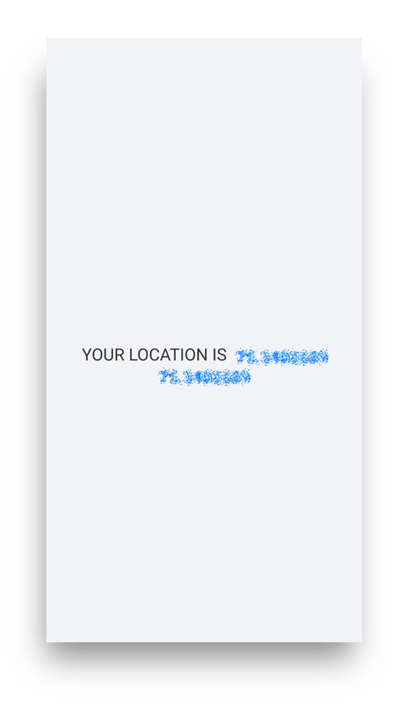

# Child Tracking System with Geofencing

This Project was a mini Project done in 5th sem of our Engineering.

### Project Members:

1. **Samartha J**
2. **Vandana**
3. **Pruthvi K R**
4. **Mahanteshgouda**

### Project Discription

Child Tracking System with Geofencing is used to ensure the safety of children in both public and private spaces is a paramount concern for parents and caretakers. This project proposes the development of a Child Tracking System with Geofencing, a web application designed to send real- time alerts to parents if their child moves~ outside a pre-defined geographic boundary. Utilizing a combination of GPS technology, and web applications. The system aims to provide a reliable and user-friendly solution for monitoring the location of children. This application will feature adjustable geofencing parameters, instant notification capabilities.
The Child Tracking System with Geofencing operates by with a web application which tracks the child’s current location, paired with another web application used by parents. Upon detecting that the child has moved outside the designated safe zone, the system will immediately send alerts to the parent's mobile device, providing real-time location updates. This technology not only ensures rapid response times in potential emergency situations but also offers a user-friendly interface for ease of use.

Note: This project does not have the capability of using GPS on the internet, as I have removed the API keys. Additionally, the web message has been replaced with 'client side works only with desktop'.

## Screenshots

#### Desktop Parent view

#### Desktop Child view (client view)

#### Mobile Parent view

#### Mobile Child view (client view)

